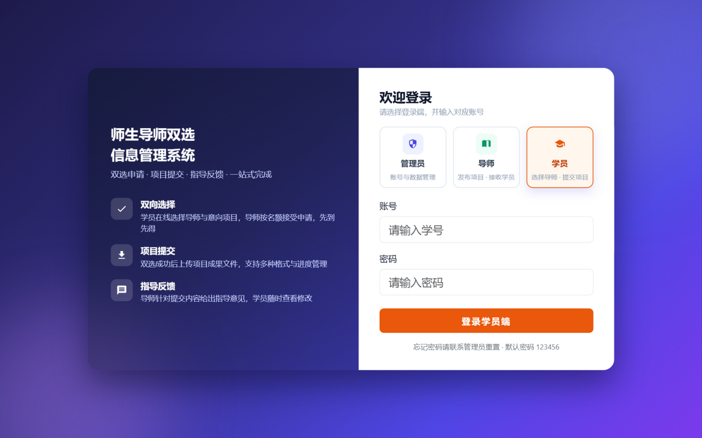
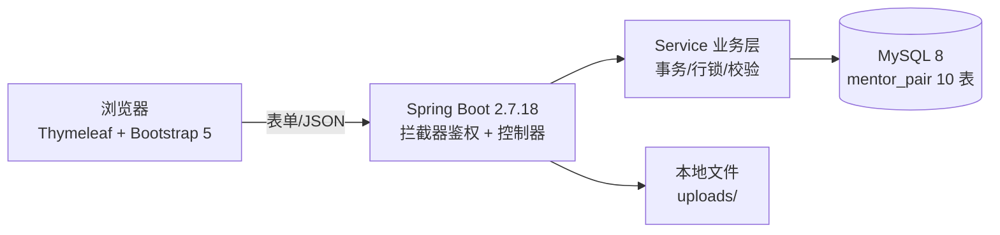

# 师生导师双选信息管理系统

<p align="left">
  
  
  
  
  
</p>

> 一套面向毕业设计场景的**师生导师双向选择系统**：学员在线挑导师，导师按名额收学生，从"双选申请"到"项目提交、指导反馈"全流程线上化，并打包为 **Windows 桌面 EXE**（自带 JRE，双击即用）。

<p align="center">
  
</p>

---

## ✨ 功能特性

**三端一体**：管理员、导师、学员共用一套系统，登录页选端进入（端别强校验），导航栏按角色变色。

| 端 | 功能 |
|---|---|
| 👑 管理员 | 数据总览看板 · **双选时间窗**设置 · 账号管理（增/改/停/重置密码/**Excel 批量导入学员**）· 项目信息管理 · 项目提交管理 · 指导信息管理 |
| 🎓 导师 | 资料与名额维护 · 项目发布/编辑/下架 · 双选申请处理（接受/拒绝、查看申请学员成绩）· **导出已接收名单（xlsx）** · 批阅提交并填写指导 · **成绩单 Excel 导入**（逐行容错） |
| 🧑‍🎓 学员 | 浏览导师与项目 · 提交双选申请（唯一性约束）· 上传项目成果文件 · 查看导师指导 |
| 🔧 通用 | 自助修改密码 · 退出系统（服务优雅关闭）· 登录端记忆 · 全部静态资源本地化（内网可用） |

**业务亮点：**

- **双选时间窗**：管理员设定起止时间，窗口外学员申请被拦（前端禁用 + 后端强校验），导师处理不受限
- **名额并发防护**：接受申请在事务内完成"锁导师名额行 → 锁学员行 → 名额校验 → 写入"（READ_COMMITTED），并发场景实测不超收、不重复
- **成绩单 Excel 导入**：表头固定"学号/姓名/成绩"，异常行逐行容错并精确到行号，单次上限 5000 行
- **用完即退的桌面交付**：jpackage 打包自带 JRE 的 EXE，双击启动自动打开登录页，"退出系统"一键安全关闭

## 🖼️ 界面预览

| 数据总览（管理员首页） | 双选时间设置 |
|---|---|
|  |  |

| 账号管理 | 学员端 · 时间窗提示 |
|---|---|
|  |  |

## 🏗️ 技术架构



| 分类 | 选型 |
|---|---|
| 语言/构建 | Java 8（`--release 8` 字节码，JDK 8~17 均可构建运行）· Maven 3.3.9 |
| 后端 | Spring Boot 2.7.18 · MyBatis-Plus 3.5.3.1 · spring-security-crypto（BCrypt） |
| 前端 | Thymeleaf · Bootstrap 5 · jQuery（**全部本地化，无外网 CDN**） |
| 数据库 | MySQL 8.0（utf8mb4，启动自动建库建表 + 幂等种子数据） |
| Excel | Apache POI 4.1.2（成绩单导入 / 已接收名单导出） |
| 桌面交付 | JDK 17 `jpackage`（app-image，自带 JRE，免安装） |

## 🚀 快速开始

### 方式一：源码构建运行

```bash
# 1. 环境要求：JDK 8+、Maven 3.3.9+、MySQL 8.0
# 2. 修改数据库账号密码（数据库会自动创建）
#    mentor-pair/src/main/resources/application.yml
mvn clean package -DskipTests
java -jar target/mentor-pair-1.0.0.jar
# 浏览器访问 http://localhost:8080/login
```

### 方式二：打包成 Windows 桌面 EXE（免装 Java）

```bash
mvn clean package -DskipTests
mkdir -p dist-stage && cp target/mentor-pair-1.0.0.jar dist-stage/
jpackage --type app-image --name 师生导师双选系统 \
  --input dist-stage --main-jar mentor-pair-1.0.0.jar \
  --main-class org.springframework.boot.loader.JarLauncher \
  --java-options "-Dfile.encoding=UTF-8 -Dserver.port=8081" --win-console --dest dist
```

双击 `dist/师生导师双选系统/师生导师双选系统.exe` 即可，详细说明见 [使用指南](使用指南.md)。

## 🔑 演示账号

| 角色 | 登录名 | 密码 | 备注 |
|---|---|---|---|
| 管理员 | admin | admin123 | 名额配置、时间窗、全局数据管理 |
| 导师 | T01 / T02 | 123456 | 各带 2 个名额、1 个开放项目 |
| 学员 | S01 ~ S04 | 123456 | 学号即登录名 |

> 正式使用前请修改全部演示密码。

## 📁 目录结构

```
├─ mentor-pair/            # 工程源码
│  ├─ src/main/java/com/mentorpair/
│  │  ├─ controller/       # 登录、管理员、导师、学员、文件下载
│  │  ├─ service/impl/     # 业务规则（名额锁、时间窗、Excel、统计）
│  │  ├─ mapper/ entity/   # MyBatis-Plus 持久层（10 表）
│  │  ├─ interceptor/      # 登录 + 角色两级拦截
│  │  └─ util/             # ExcelUtil（POI）、TextUtil
│  ├─ src/main/resources/
│  │  ├─ db/               # schema.sql + data.sql（幂等，可重复执行）
│  │  ├─ templates/        # 三端页面（Thymeleaf）
│  │  └─ static/           # 本地化的 bootstrap/jquery + 自定义主题
│  ├─ dist/                # EXE 成品（不入库，见 .gitignore）
│  └─ README.md            # 部署细节
├─ docs/screenshots/       # 界面截图
├─ 技术指导文档.md          # 需求/设计/验收用例/四轮缺陷修复记录（v1.0→v1.7）
├─ verify_api.py           # 接口级验收回归脚本
└─ 使用指南.md              # 小白版操作手册（随 EXE 分发）
```

## ✅ 质量保障

- **27/27** 接口级验收用例通过（三角色全闭环、中文逐字比对、文件上传下载权限）
- **并发三层防护**：时间窗校验 → 学员行/导师行锁（固定顺序防死锁）→ READ_COMMITTED 快照校验；实测并发申请恰好一人成功、并发接受不超收不重复接收
- **浏览器视觉走查**两轮 + **接口回归四轮**，累计发现并修复缺陷 15+（含 SQL 编码、并发竞态、会话固定等），完整记录见 [技术指导文档](技术指导文档.md) §9

## 📚 文档

| 文档 | 内容 |
|---|---|
| [使用指南.md](使用指南.md) | 小白版：环境准备、启动、三端操作步骤、FAQ |
| [学生端使用说明](docs/manuals/学生端使用说明.md) | 学员操作手册：选导师、申请、上传文件、看指导（含截图） |
| [导师端使用说明](docs/manuals/导师端使用说明.md) | 导师操作手册：资料/项目/申请处理/批阅指导/成绩导入（含截图） |
| [管理员端使用说明](docs/manuals/管理员端使用说明.md) | 管理员操作手册：建号/批量导入、时间窗、数据管理、运维清单（含截图） |
| [技术指导文档.md](技术指导文档.md) | 需求、技术选型、数据库设计、里程碑、验收标准、缺陷修复记录 |
| [verify_api.py](verify_api.py) | 接口级验收回归脚本（Python 3，无需额外依赖） |

## ❓ 常见问题

- **端口被占用？** 改 `application.yml` 的 `server.port`（EXE 版同时改 `app\师生导师双选系统.cfg` 里的 `-Dserver.port`）
- **数据库连接失败？** 确认 MySQL 服务运行中，核对 `application.yml` 的账号密码
- **忘记密码？** 管理员在"账号管理"重置（重置为 123456）
- 更多问题见 [使用指南 · FAQ](使用指南.md)

---

<p align="center">本项目基于 <a href="LICENSE">MIT License</a> 开源 · 欢迎学习交流与二次开发</p>
