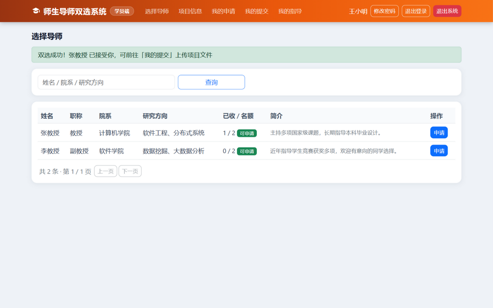
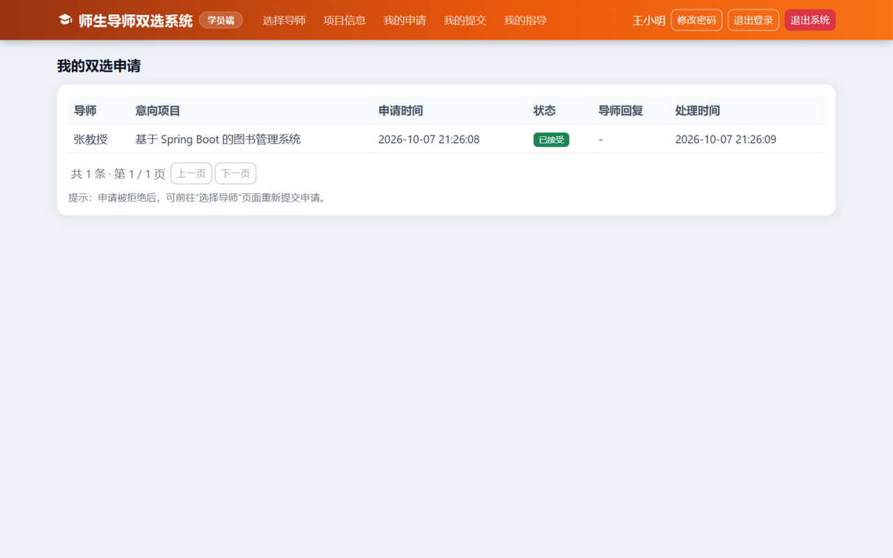
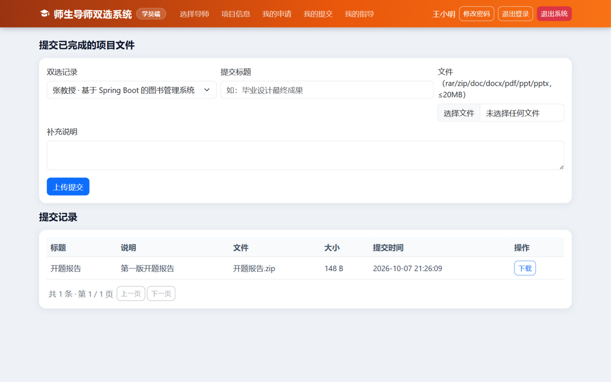
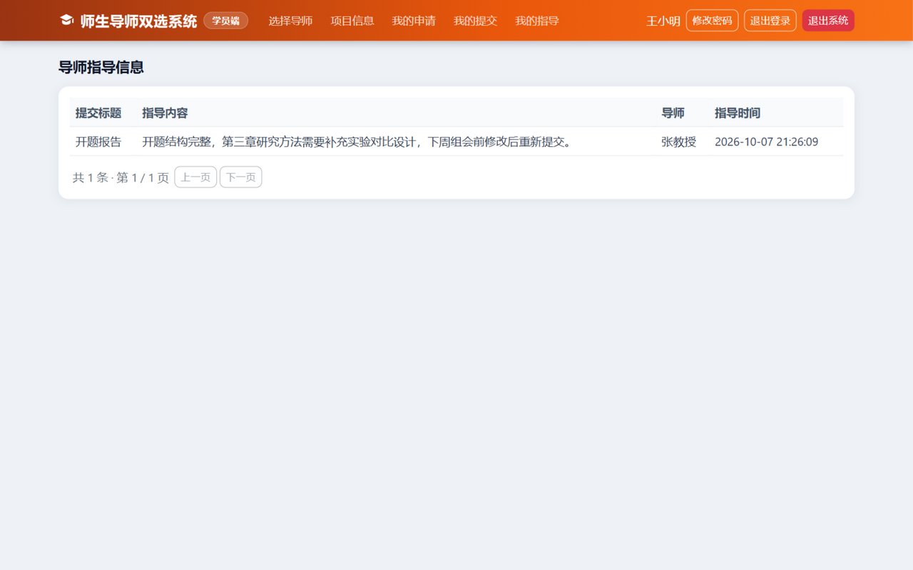

# 学生端使用说明

> 适用对象：**学员**。全套操作只需要一个浏览器，跟着步骤点就行。
> 遇到和本文不一致的提示，优先看屏幕上的提示文字，大部分提示都写明了原因和解决办法。

---

## 1. 登录

1. 双击桌面/软件文件夹里的 `师生导师双选系统.exe`，等浏览器自动打开登录页（没打开就手动访问 `http://localhost:8081/login`）。
2. 在登录页点击 **「学员」** 卡片（选中后卡片会变成橙色）。
3. 输入管理员发给你的 **学号** 和 **密码**（初始密码一般是 `123456`）→ 点「登录学员端」。

登录后右上角会显示你的姓名。**第一次登录建议先点「修改密码」换成自己的密码。**

## 2. 界面导览

登录后顶部橙色导航栏就是你的全部功能：

| 菜单 | 干什么用 |
|---|---|
| 选择导师 | 浏览导师名单，提交双选申请 |
| 项目信息 | 查看导师发布的所有开放项目 |
| 我的申请 | 查看申请的处理状态 |
| 我的提交 | 双选成功后，上传项目成果文件 |
| 我的指导 | 查看导师写给你的指导意见 |

## 3. 选择导师（核心操作）

1. 菜单点「**选择导师**」。表格里能看到每位导师的职称、院系、研究方向和 **剩余名额**（显示为"已收 / 名额"，带绿色"可申请"或灰色"已满"标记）。
2. 想好选谁后，点该行右侧的「**申请**」按钮。
3. 弹窗里可以**下拉选择一个该导师的项目**（也可以选"不指定项目"）。
4. 点「确认提交」→ 提示"申请已提交，请等待导师处理"。

**三条重要规则：**

- 每人**同时只能有一个**"待处理/已接受"的申请，不能广撒网；
- 申请被**拒绝**后才能重新申请其他导师（拒绝原因会显示给你）；
- 名额先到先得——导师名额满了，后来的人就申请不进了。

> 页面顶部如果有横幅，那是系统在提醒你重要信息：绿色是"双选成功"，黄色是"申请处理中"，红色是"被拒绝（附原因）"。如果管理员设置了双选时间窗，这里也会显示"双选进行中/未开始/已截止"，窗口外申请按钮会变灰。

## 4. 查看申请状态

菜单「**我的申请**」可以看到每条申请的状态：

- **待处理**：导师还没看，耐心等；
- **已接受**：双选成功！去「我的提交」交文件；
- **已拒绝**：看"导师回复"一栏的原因，回「选择导师」重新申请。

## 5. 上传项目文件

双选成功后，菜单「**我的提交**」：

1. "双选记录"下拉框选你的双选（一般只有一条）；
2. 填**提交标题**（如"开题报告"、"毕业设计最终稿"）和补充说明；
3. 点「选择文件」选中文件 → 点「上传提交」→ 确认。

**文件规则（不满足会被拒）：**

| 规则 | 说明 |
|---|---|
| 类型 | 只收 `rar / zip / doc / docx / pdf / ppt / pptx` |
| 大小 | 单个文件不超过 **20MB** |
| 次数 | 可以多次提交（比如先交开题报告、再交中期、再交终稿），导师都能看到 |

## 6. 查看导师指导

菜单「**我的指导**」：导师针对你每次提交写的意见都在这里（含指导时间）。看到意见后修改作品，再次提交新版本即可，导师会接着批。

## 7. 常见问题

| 问题 | 处理 |
|---|---|
| 申请按钮是灰的 | 双选时间窗未开始或已截止，页面横幅有说明；急就找管理员 |
| 提示"您已有待处理或已接受的双选申请" | 这是防重复保护，去「我的申请」看现有申请的状态 |
| 忘记密码 | 找管理员重置（重置后是 `123456`），登录后尽快改掉 |
| 文件传不上去 | 看提示：类型不对或超过 20MB，压缩后再传 |
| 想换导师 | 只有当前申请被拒绝后才能重新申请；如果已被接受想换，找管理员协调 |
