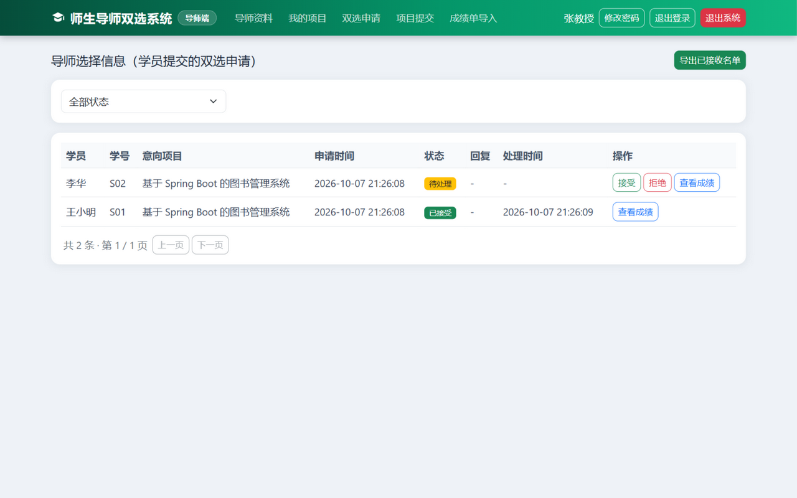
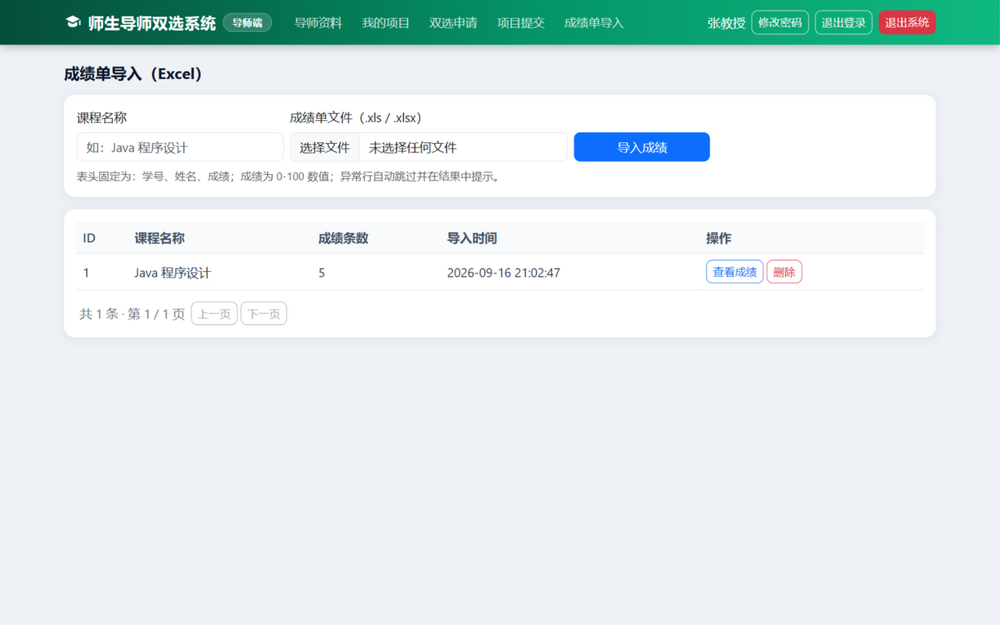

# 导师（教师）端使用说明

> 适用对象：**导师**。所有操作在浏览器里完成，本说明按实际工作顺序编写：完善资料 → 发布项目 → 收学生 → 批阅指导。

---

## 1. 登录

1. 双击 `师生导师双选系统.exe`，浏览器自动打开登录页（或手动访问 `http://localhost:8081/login`）。
2. 点击 **「导师」** 卡片（选中后变绿色）。
3. 输入管理员分配的登录名（如 `T01`）和密码（初始 `123456`）→ 点「登录导师端」。

**第一次登录请先做两件事：点右上角「修改密码」改掉初始密码；去「导师资料」完善个人信息。**

## 2. 界面导览

登录后绿色导航栏包含：

| 菜单 | 干什么用 |
|---|---|
| 导师资料 | 维护职称、院系、研究方向、**招生名额**、个人简介 |
| 我的项目 | 发布 / 编辑 / 下架毕业设计项目 |
| 双选申请 | 处理学生的申请（接受/拒绝），查看学生成绩，导出名单 |
| 项目提交 | 查看学生交的文件、下载、写指导意见 |
| 成绩单导入 | 把课程成绩 Excel 导入系统，处理申请时作参考 |

## 3. 完善资料（第一件事）

菜单「**导师资料**」→ 填写 **职称、院系、研究方向、个人简介**，重点设置「**可带学员名额**」——这是你最多能接收的学生数，学生端会显示剩余名额 → 点「保存资料」。

> 名额随时可以改。名额填 0 表示暂不招生（学生仍可申请，但你无法接受）。

## 4. 发布项目

菜单「**我的项目**」→ 右上角「**发布项目**」→ 填项目名称（100 字内）和项目说明/任务要求 → 保存。

- 发布后学生端立刻可见；点「**下架**」可让学生不再看到；
- 已有学生申请的项目也可以继续「编辑」修改内容。

## 5. 处理学生的双选申请（核心操作）

菜单「**双选申请**」：

每条申请的"状态"列会标 **待处理 / 已接受 / 已拒绝**，操作按钮：

| 按钮 | 说明 |
|---|---|
| **查看成绩** | 弹窗显示该学生历次被导入的课程成绩（按学号匹配），辅助你判断 |
| **接受** | 名额内才会成功；名额满时系统自动拦截并提示"名额已满"，**先到先得** |
| **拒绝** | 可填拒绝原因（200 字内），学生会看到原因并可改投其他导师 |

右上角「**导出已接收名单**」可随时下载 Excel 名单（学号、姓名、意向项目、申请与接受时间），用于存档或上报。

**注意：** 接受/拒绝不受双选时间窗限制——即使申请通道已截止，你仍可以处理完剩余申请。

## 6. 批阅学生的项目提交、写指导

学生交了文件后，菜单「**项目提交**」：

- 点「**下载**」查看学生交的文件（原始文件名不变）；
- 点「**指导**」写下你的意见（如"第三章研究方法需要补充实验对比设计"）→ 提交。学生端"我的指导"立刻可见；
- 同一提交可以多次写指导（每次意见单独成条）。

## 7. 导入学生成绩单（可选，但很有用）

菜单「**成绩单导入**」：

**第一步：在 Excel 里做成绩表。** 第一行表头固定为三列，顺序不能乱：

| 学号 | 姓名 | 成绩 |
|---|---|---|
| S01 | 王小明 | 90 |
| S02 | 李华 | 85.5 |

**第二步：导入。** 页面上填一个**课程名称**（同一门课只能导入一次）→ 选择该 Excel → 点「导入成绩」。

**系统会反馈"成功几条、失败几条"**，失败的会精确到行号和原因（比如"第3行：成绩"缺考"不是数字"）。有问题的行不影响其他行导入。

- 成绩按**学号**匹配学生——即使某学生还不是系统用户也能先录入；
- 单次最多 5000 行；录错了可以整门课程「删除」重新导。

## 8. 常见问题

| 问题 | 处理 |
|---|---|
| 提示"名额已满"但想再收 | 去「导师资料」调大名额，再回"双选申请"接受 |
| 提示"该学员已被其他导师接收" | 该学生已和别人配对成功，接受下一位即可 |
| 提示"该申请已处理，请勿重复操作" | 刷新页面看最新状态，不用重复点 |
| 忘记密码 | 找管理员重置（重置后是 `123456`） |
| Excel 导入报"表头不正确" | 检查第一行是否严格为"学号、姓名、成绩"三列、顺序一致、无多余列 |
