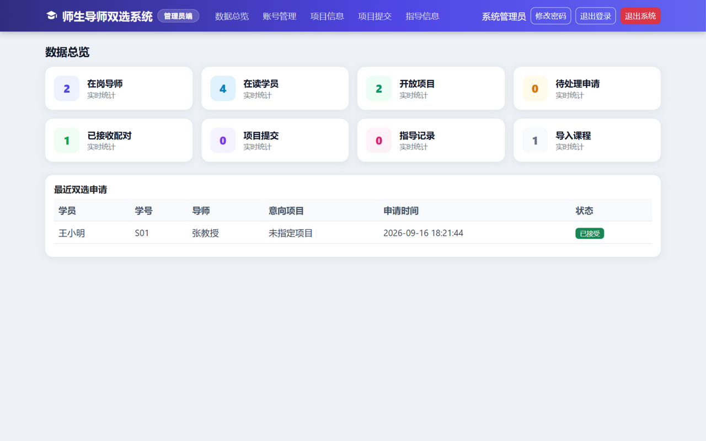
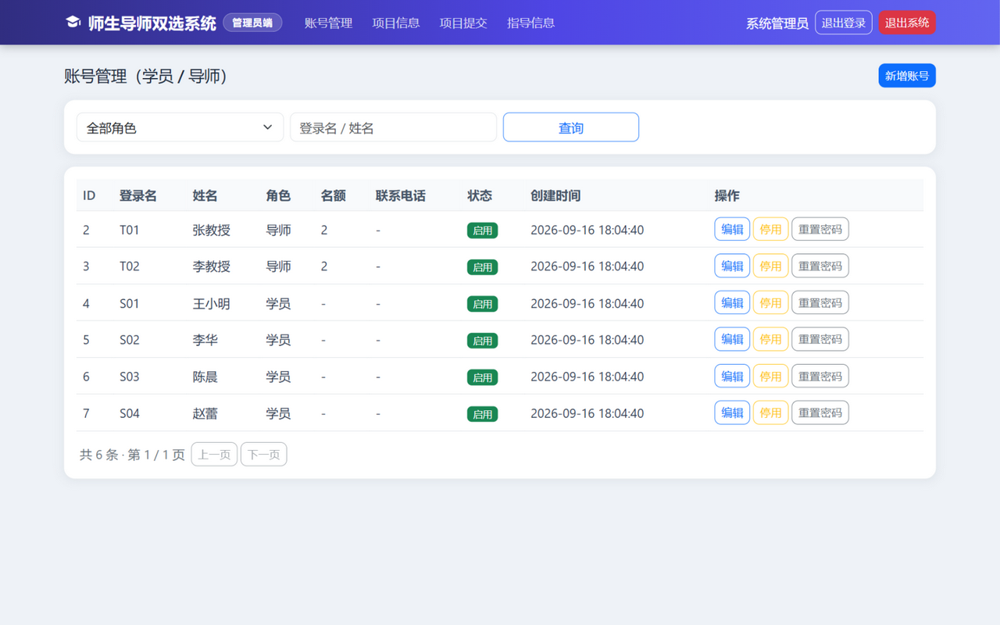
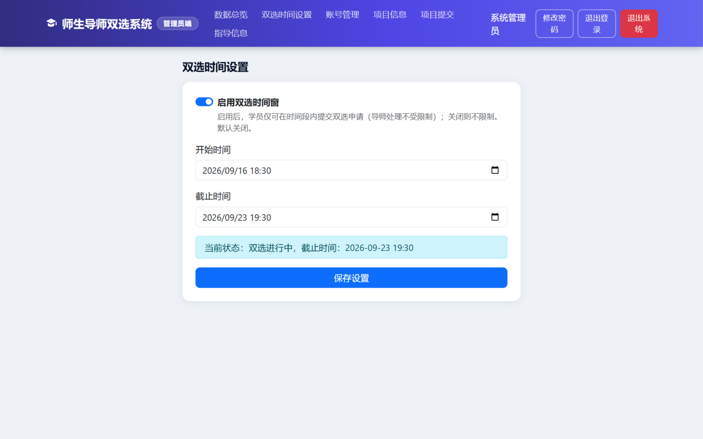

# 管理员端使用说明

> 适用对象：**管理员**（系统后勤管家）。你负责把"人、项目、数据"管好，让导师和学生顺利双选。

---

## 1. 登录

1. 双击 `师生导师双选系统.exe`，浏览器自动打开登录页（或手动访问 `http://localhost:8081/login`）。
2. 点击 **「管理员」** 卡片（选中后变靛蓝色）。
3. 输入 `admin` / `admin123`（出厂默认）→ 登录，落在"数据总览"页。

**⚠️ 正式使用前第一件事：点右上角「修改密码」，把默认密码改掉。**

## 2. 界面导览

靛蓝色导航栏 + 首页数据总览：

总览页有 9 张卡片：在岗导师、在读学员、开放项目、待处理申请、已接收配对、项目提交、指导记录、导入课程，以及**双选状态**（不限/进行中/未开始/已截止，点击直达设置页）。下方"最近双选申请"显示最新动态。

## 3. 建导师账号

菜单「**账号管理**」→ 右上角「**新增账号**」：

1. 角色选 **导师**；
2. 填登录名（如 `T03`，导师用它登录）、初始密码、姓名、联系电话；
3. **"可带学员名额"填一个数**（如 2，导师自己之后也能改）→ 保存。

把登录名和密码告诉导师本人，让他登录后自行改密码、完善资料。

## 4. 建学员账号（单个或批量）

**单个创建**：新增账号 → 角色选 **学员** → 登录名直接填**学号**（如 `S05`）→ 填姓名，学号栏留空会自动与登录名一致 → 选填专业、班级 → 保存。

**批量导入（推荐开学季用）**：账号管理页 →「**批量导入学员**」→ 选择 Excel 文件 → 开始导入。

Excel 模板：**第一行表头固定五列：学号、姓名、密码、专业、班级**（一行一个学员，密码可留空默认 `123456`）：

| 学号 | 姓名 | 密码 | 专业 | 班级 |
|---|---|---|---|---|
| S20 | 张三 | | 软件工程 | 软工2301 |
| S21 | 李四 | abc12345 | 计科 | 计科2302 |

导入后会反馈"成功几个、失败几个"，失败行会说明原因（如学号重复）。单次最多 1000 行。

## 5. 管理已有的账号

账号管理列表支持按角色筛选、按登录名/姓名搜索：

| 操作 | 说明 |
|---|---|
| 编辑 | 改姓名、电话、导师名额 |
| 停用 / 启用 | 停用后该账号无法登录。**注意**：有未完结双选关系的账号会被系统拦下（防止产生没人管的学生），请先让相关导师/学员处理完 |
| 重置密码 | 把该账号密码重置为 `123456`，用于忘记密码时 |

## 6. 设置双选时间窗（规定什么时候能选）

菜单「**双选时间设置**」：

- 打开「启用双选时间窗」开关 → 填 **开始时间** 和 **截止时间** → 保存；
- 生效后：没开始/已截止时，学员端申请按钮禁用，后台也会拦截（页面会显示原因）；
- **导师处理申请不受时间窗限制**，截止后仍可把没批完的申请处理完；
- 关闭开关 = 不限时间（默认）。

设置正确时页面会显示当前状态（绿色"双选进行中"等）。总览页的"双选状态"卡也会同步。

## 7. 监督业务数据

| 菜单 | 说明 |
|---|---|
| 项目信息 | 全部项目的列表，支持搜索；可以下架、删除（删除需二次确认，相关申请会保留但不再显示项目名） |
| 项目提交 | 学员交的所有文件，可下载、删除 |
| 指导信息 | 所有指导意见，可查看、删除 |

**原则：这几页是"监督与善后"用**——日常业务让导师和学员自己在各自端完成，你只需要在出问题时介入。

## 8. 日常运维清单

| 时机 | 要做什么 |
|---|---|
| 学期初 | 建导师/学员账号（或批量导入）、改默认密码、让导师填名额 |
| 双选开始前 | 设置时间窗；提醒导师发布项目 |
| 双选截止后 | 在总览页核对"已接收配对"数；处理遗留的待处理申请（找相应导师） |
| 定期 | 双击 `tools\backup.bat` 备份数据库（首次使用先改脚本里的密码） |
| 用完系统 | 点右上角"退出系统"或关掉 exe 的黑色控制台窗口 |

## 9. 常见问题

| 问题 | 处理 |
|---|---|
| 停用账号被拦 | 该账号还有未完结的双选关系，按提示先让导师/学员处理，或先不启用 |
| 学员说"申请交不了" | 看"双选时间设置"的状态，未开始/已截止都会拦；调整时间或关闭开关 |
| 导师说看不到学生成绩 | 成绩按学号匹配，确认该导师导入了含该学号的成绩单 |
| 管理员密码忘了 | 只能在数据库层面处理，请找懂技术的人；所以务必把密码记牢 |
| 想彻底清空重来 | 备份后删除 `mentor_pair` 数据库，重启 exe 会自动重建并写入演示数据 |
